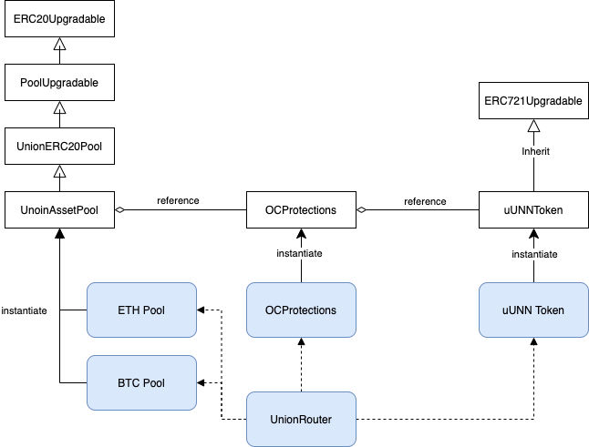

# protection-contracts

In this acticle

- [List of contract with descriptions](#list-of-contract-with-descriptions)
- [UnionAssetPool](#unionassetpool)
- [uUNNToken](#uunntoken)
- [OCProtections](#ocprotections)
- [UnionRouter](#unionrouter)
- [How MCR is handled inside UnionERC20Pool](#how-mcr-is-handled-inside-unionerc20pool)

## List of contract with descriptions:

### UnionAssetPool

Dedicated to assemble capital (in form of ERC20 tokens) and use it for backing protections. The system makes money from selling protections and it’s revenue comes from distributing matured protections premiums.

UnionAssetPool consists of 4 contracts in direct inheritance structure:
1.	ERC20Upgradeable - Upgradable implementation of ERC20 token by OpenZeppelin.   
2.	PoolUpgradeable - Implementation of a standard DeFi style pool which takes money from users and issues Liquidity tokens back (pUNN in this case). Tracks totalCap of the pool and implements business logic of liquidity token pricing (liquidity token price = totalCap/totalSupply) as well as standard deposit / withdrawal operations. 
3.	UnionERC20Pool - Extension of the standard DeFi pool which handles:

    a.	 MCR (Minimum Capital Requirement) and dependent logic. 
    
    b.	Distribution of the pool revenue between different “reserve” funds. 
    
    c.	Contract Pausing feature
    
    d.	ACL 
4.	UnionAssetPool - Extension of the UnionERC20Pool, which brings in an underlying asset for OCProtections and provides asset-related features like asset price checks, etc. This contract also implements:
    
    a.	OCProtection coverage payout.
    
    b.	Premiums lifecycle (acquiring->locking->maturing)
    
    c.	Overriding withdrawal operations (it depends on underlying asset price for this particular type of protection).

### uUNNToken

uUNNToken is a central registry for all issued protections by Union Protocol. Each protection is issued in a form of ERC721 token, so this contract naturally inherits ERC721 implementation.

uUNNToken consists of 2 contracts in direct inheritance structure:
1.	ERC721Upgradeable  - upgradable ERC721 implementation by OpenZeppelin
2.	uUNNToken - extension of the ERC721 that references individual protection storage contracts (OCProtections for example, which is storage for all OC Protections issued)

### OCProtections

Storage or all Optimizing Collateralization (OC) protections issued by UnionProtocol. Is referenced by uUNNToken. This contracts provides the following features for users:

1.	Selling of the OC Protections (create & createTo functions) - creates and sells OCProtection.
2.	Exercises OCProtections - in case… 
3.	Provides an interface for keeping accompanied documentation for OCProtections. 
4.	Implements Pausable feature
5.	Implements ACL.

### UnionRouter

A central protocol interface smart contract. Provides references to all protocol protection products. 

## How MCR is handled inside UnionERC20Pool

MCR is actually a bottom level pool capital. At any point of time there should be more capital in the pool (basic ERC20 tokens) then MCR value. The complexity of the UnionProtocol is that MCR is calculated off-chain on the back-end and to be provided to the smart contract by “trusted party”. Such trusted parties are validated by a digital signature, which public key that should be whitelisted with an MCR_PROVIDER role in every UnionERC20Pool. 

Race condition problem for off-chain calculated MCR:
Imagine that N protection buyers hit the backend at the same time and ask for price quote to be generated. Backend generates quotes as of block B, having MCR calculated as of block B (assume this value is bMCR). This technically allows all buyers to buy protection, which naturally increases MCR by sum(iMCR) where iMCR is individual MCR increase for each protection issued. This way as of block B+1, resulting MCR would be bMCR+sum(iMCR), assuming all N users fitted their transactions into B+1 block. But what if the resulting MCR value is greater than the total capital that corresponding pool operates? How can Pool avoid such a case? 

The implementation splits the pool MCR into 2 parts: final MCR and pending (queued) MCR. Final MCR is an MCR value calculated by the trusted backend as of B block. Each calculation will naturally increase B and include all transactions related to pool into this calculation. Pending MCR is a total value of all iMCRs from all new protections sold since B block. iMCRs are stored in queue along with the block numbers where such protections were created (iB) and removed from queue each time a new Final MCR is provided calculated as of block number B > iB. This way the pool can monitor it’s MCR and discard all transactions which increase MCR from the point where bMCR+sum(iMCR) reaches total pool capital. 
